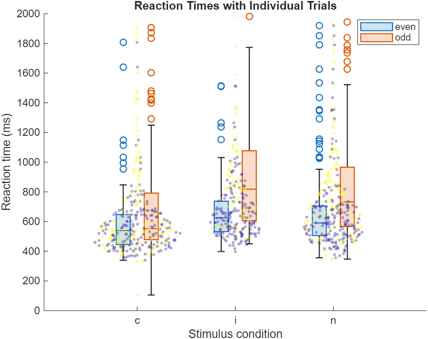
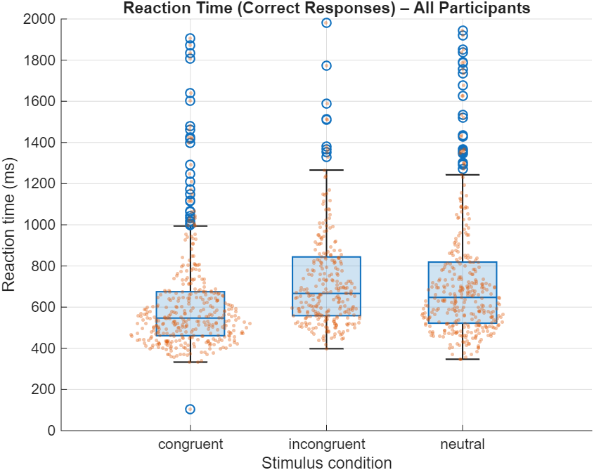
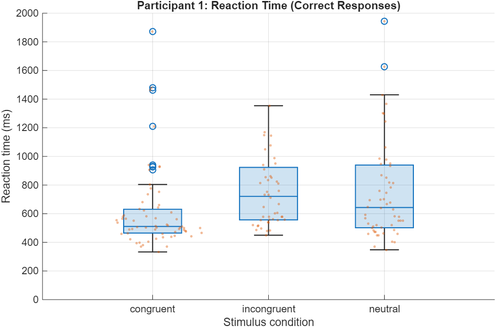

# Numerical Stroop Task Experiment and Behavioral Data Analysis


A behavioral cognitive neuroscience project implementing a **Numerical Stroop Task** in OpenSesame, with reaction-time analysis reproduced in both **MATLAB** and **Python**.

---

## Project Snapshot

This repository demonstrates a complete behavioral experiment workflow:

- Numerical Stroop task design in OpenSesame
- Participant-level behavioral data collection
- Reaction-time cleaning and preprocessing
- Correct-trial filtering
- Condition-wise behavioral analysis
- Group-level visualization
- Individual participant visualization
- Cross-platform analysis replication in MATLAB and Python
- Presentation-ready project documentation

The project focuses on cognitive interference, selective attention, reaction-time differences, and reproducible behavioral data analysis.

---

## Overview

The Numerical Stroop Task is a cognitive interference paradigm. In this experiment, participants were asked to identify the **numerically larger digit** while ignoring irrelevant differences in **physical size**.

The task creates conflict when the numerical value and physical size of the stimuli are incongruent. This makes the paradigm useful for studying:

- Cognitive control
- Interference processing
- Selective attention
- Response conflict
- Reaction-time differences across task conditions

This repository includes the OpenSesame experiment file, anonymized participant data, MATLAB analysis scripts, Python analysis scripts, generated visual outputs, and presentation materials.

---

## Research Aim

The main aim of this project was to examine whether reaction times differ across Numerical Stroop task conditions.

The central behavioral question was:

> Do participants show reaction-time differences across numerical comparison conditions in a Numerical Stroop task?

---

## Experimental Design

Participants completed a Numerical Stroop task involving numerical comparison under different stimulus conditions.

The repository includes behavioral data from:

```text
6 participants
```

Because of the small sample size, the analysis is interpreted as a **behavioral workflow demonstration** rather than confirmatory evidence.

---

## Behavioral Measures

The main behavioral measures were:

- Reaction time
- Accuracy

The analysis in this repository focuses primarily on:

```text
reaction times for correct responses
```

This approach reduces the influence of incorrect trials on condition-wise reaction-time estimates.

---

## Tools Used

| Tool | Purpose |
|---|---|
| OpenSesame | Task design and experiment implementation |
| MATLAB | Behavioral data cleaning, analysis, and visualization |
| Python | Reproducible analysis replication |
| Jupyter Notebook | Interactive analysis and documentation |
| pandas / NumPy | Data handling and numerical analysis |
| matplotlib | Visualization |
| PowerPoint / PDF | Project presentation materials |

---

## Repository Structure

```text
numerical-stroop-task/
├── data/
│   ├── subject-1.csv
│   ├── subject-2.csv
│   ├── subject-3.csv
│   ├── subject-4.csv
│   ├── subject-5.csv
│   └── subject-6.csv
│
├── experiment/
│   └── stroop_task.osexp
│
├── presentation/
│   ├── stroop_task_presentation.pdf
│   └── stroop_task_presentation.pptx
│
├── results/
│   ├── all_participants/
│   │   └── all_participants_boxplot.png
│   │
│   ├── group_comparison/
│   │   └── group_odd_even_boxplot.png
│   │
│   └── individual/
│       ├── participant_1_boxplot.png
│       ├── participant_2_boxplot.png
│       ├── participant_3_boxplot.png
│       ├── participant_4_boxplot.png
│       ├── participant_5_boxplot.png
│       └── participant_6_boxplot.png
│
├── scripts/
│   ├── main_analysis.m
│   ├── stroop_analysis.ipynb
│   └── stroop_analysis.py
│
└── README.md
```

---

## Analysis Workflow

The analysis followed this general workflow:

```text
OpenSesame task
→ participant CSV files
→ data cleaning
→ correct-trial filtering
→ reaction-time extraction
→ participant-level visualization
→ group-level visualization
→ MATLAB/Python replication
```

---

## Example Figures

### Group-Level Reaction Time Comparison



### All Participants Reaction Time Summary



### Example Individual Participant Plot



---

## MATLAB Analysis

The MATLAB workflow performs:

- CSV data loading
- participant-wise reaction-time extraction
- filtering for correct responses
- condition-wise reaction-time calculation
- individual participant visualization
- group-level comparison plots

Main script:

```text
scripts/main_analysis.m
```

---

## Python Analysis

The Python workflow reproduces the behavioral analysis using Python tools.

Main files:

```text
scripts/stroop_analysis.py
scripts/stroop_analysis.ipynb
```

The Python analysis demonstrates reproducibility across programming environments and provides a flexible workflow for future extension.

---

## Presentation Materials

The repository includes presentation files summarizing the project:

```text
presentation/stroop_task_presentation.pdf
presentation/stroop_task_presentation.pptx
```

These files provide a presentation-oriented overview of the task design, analysis workflow, and behavioral outputs.

---

## Key Exploratory Output

The expected Numerical Stroop pattern is that reaction times vary depending on the degree of cognitive interference or stimulus-response conflict.

Given the small sample size, this project is presented as an experimental and computational workflow demonstration rather than a confirmatory behavioral study.

---

## How to Run

### MATLAB

Open MATLAB and run:

```matlab
scripts/main_analysis.m
```

### Python

Install required Python packages:

```bash
pip install pandas numpy matplotlib jupyter
```

Run the Python script:

```bash
python scripts/stroop_analysis.py
```

Or open the Jupyter notebook:

```bash
jupyter notebook scripts/stroop_analysis.ipynb
```

---

## Requirements

The Python analysis requires:

```text
pandas
numpy
matplotlib
jupyter
```

Install manually with:

```bash
pip install pandas numpy matplotlib jupyter
```

---

## Skills Demonstrated

This project demonstrates:

- Behavioral experiment design
- OpenSesame task implementation
- Cognitive interference paradigm construction
- Reaction-time data cleaning
- Correct-trial filtering
- Participant-level behavioral analysis
- Group-level behavioral analysis
- MATLAB-based data analysis
- Python-based analysis replication
- Jupyter Notebook workflow
- Data visualization
- Reproducible behavioral neuroscience project organization

---

## Limitations

This project is exploratory and portfolio-focused.

Main limitations:

1. Small sample size.
2. Reaction-time analysis is descriptive and exploratory.
3. Results should not be interpreted as confirmatory evidence.
4. The main value of the repository is the reproducible behavioral analysis workflow.

---

## Future Improvements

Possible extensions include:

- Increasing the sample size
- Adding formal statistical testing
- Computing effect sizes
- Adding accuracy analysis
- Modeling reaction times with mixed-effects models
- Adding trial-level analysis
- Improving visualization with publication-style plots
- Adding a short methods report in the repository

---

## Project Positioning

This project serves as a behavioral cognitive neuroscience workflow demonstrating how an experimental psychology task can be designed, run, analyzed, visualized, and reproduced across MATLAB and Python.

It complements more advanced EEG/fMRI pipeline projects by showing foundational experience in behavioral experiment design and reaction-time analysis.
